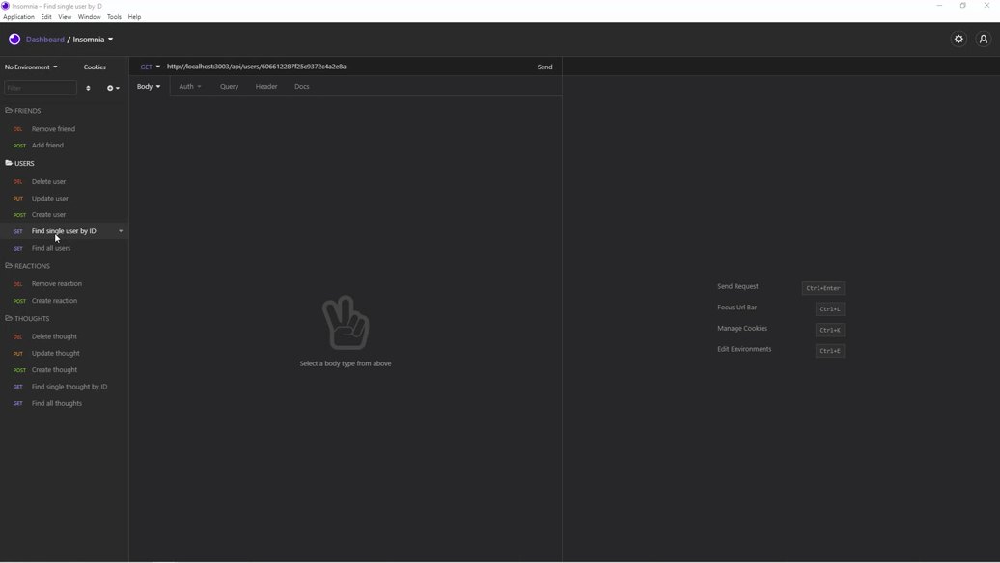

# social-network-API

  
  

## Description
Social Network API is an API for a social network web application where users can share their thoughts, react to friends’ thoughts, and create a friend list. This API is built by Express.js, MongoDB database, and Mongoose package.

The details for how this API work is in **Tests** section.

## Table of Contents
* [Installation](#installation)
* [Usage](#usage)
* [License](#license)
* [Contributing](#contributing)
* [Tests](#tests)
* [Credits](#credits)
* [Questions](#questions)

## Installation
Instructions to get the application run: 
1. Download and install [Visual Studio Code](https://code.visualstudio.com/Download) if user don't have it installed in the computer. 
2. Download and install [Node.js](https://nodejs.org/en/) if user don't have it installed in the computer. 
3. Open the terminal, first run `npm install express mongoose moment` to install all the packages: 
    * `express` is for the API routes.
    * `mongoose` is Object Data Manager.
    * `moment` is for format the timestamps. 

The application server itself runs by command `npm start`.

## Usage

Social Network API gives a social network API: 
1. when user enters the command to invoke the application, then the server is started and the Mongoose models are synced to the MongoDB database.
2. when user opens API GET routes in Insomnia Core for users and thoughts, then the data for each of these routes is displayed in a formatted JSON. 
3. when user tests API POST, PUT, and DELETE routes in Insomnia Core, then user is able to successfully create, update, and delete users and thoughts in the database.
4. when user tests API POST and DELETE routes in Insomnia Core, then user is able to successfully create and delete reactions to thoughts and add and remove friends to a user’s friend list.
  
**The demoes for API testing are in Tests section**

## License
  
This project is under license MIT
  
[License Link](https://choosealicense.com/licenses/)

## Contributing
Not Available 

## Tests

The application's API routes being tested in Insomnia Core.

[Start Server, Find All Users and Thoughts](https://drive.google.com/file/d/1aUE8ofwP-MODWQZMRabN_w3ueMoDxPlG/view)

[Find Single User and Thought By ID](https://drive.google.com/file/d/1G23kkjvoWM5LGZrrrzBNb9Qu_F5EZ9Dv/view)

[User Create, Update, and Delete](https://drive.google.com/file/d/14T5Q-9GgP3GB-Hh0YBuDHpUYRqxlqox1/view)

[Thought Create, Update, and Delete](https://drive.google.com/file/d/1w1Trfwvua9B-_1_st22i-gruPSl5wsT3/view)

[Friend Create and Delete](https://drive.google.com/file/d/1eFAnS7cwKcfzFXVon7onKgmPOWNW3k4f/view)

[Reaction Create and Delete](https://drive.google.com/file/d/16Onu6aqDa4-1xZzJ3YbCbNnwCmjOs3Rt/view)

## Credits
The lists of resources used to complete this challenge: 
1. Module 18 NoSQL from canvas. 
2. Google (https://www.google.ca/) 
3. MDN Web Docs (https://developer.mozilla.org/en-US/docs/Web/JavaScript).
4. mongoDB (https://docs.mongodb.com/manual/mongo/).
5. mongoose (https://mongoosejs.com/). 
6. mongoose validation (https://mongoosejs.com/docs/validation.html). 
7. moment npm (https://www.npmjs.com/package/moment).
8. Supports from instructor, assistant instructor and Tutor.

## Questions

For any questions, please contact me with the information below:

GitHub: [@shanshantina](https://github.com/shanshantina)
 
Email: tinaxu84@gmail.com